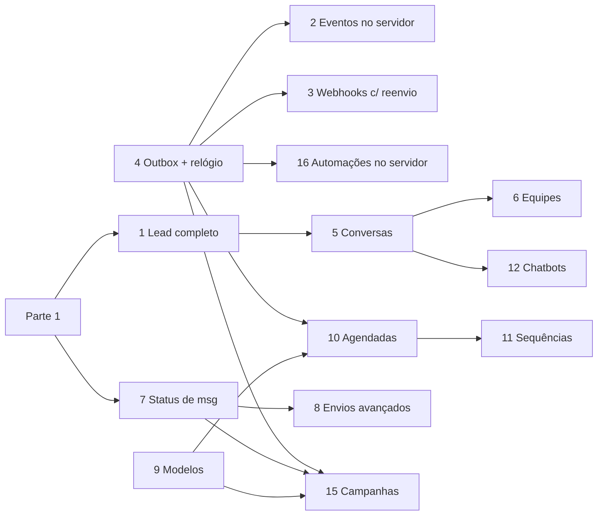

# 30 — Parte 2: visão geral (DESENHO — não implementar sem liberação)

> **Status: desenho para discussão.** Nenhum bloco desta parte pode ser implementado até o
> Agadir mandar uma mensagem dizendo qual bloco foi liberado. Se você terminou a Parte 1 e está
> sem tarefa, **pare e avise**; não puxe nada daqui por conta própria.
>
> Você pode (e deve) **ler e comentar**: se ao ler o código achar que algum desenho está errado
> ou tem um caminho mais simples, escreva em `relatorios/P2-comentarios.md`.

A Parte 2 muda tabelas existentes, comportamento de tela ou infraestrutura. Cada bloco vira, na
hora de executar, um plano de tarefas próprio no mesmo formato da Parte 1.

## Blocos

| # | Bloco | Detalhe | Depende de |
| --- | --- | --- | --- |
| 1 | Lead como negócio completo (valor, responsável, prazo, ganho/perdido, motivos) | `31` | Parte 1 |
| 2 | Eventos de CRM gerados no servidor (fim do `/api/integrations/emit`) | `32` | 4 |
| 3 | Webhooks: várias assinaturas, reenvio, registro de entregas | `32` | 4 |
| 4 | **Fundação:** fila de eventos (outbox) + relógio no servidor (`pg_cron`) | `32` | — |
| 5 | Conversas completas (status, responsável, encerrar, filas, métricas) | `33` | 1 |
| 6 | Equipes (se aprovado) | `35` | 5 |
| 7 | Status de mensagem (entregue/lida) | `35` | Parte 1 + P1-S3 |
| 8 | Envios avançados (áudio, apagar, "digitando", citar) | `35` | 7 |
| 9 | Modelos de mensagem | `35` | — |
| 10 | Mensagens agendadas | `35` | 4, 9 |
| 11 | Sequências | `35` | 4, 9, 10 |
| 12 | Chatbots no n8n (bot padrão por número + bots sob demanda) | `35` | 5 |
| 13 | Várias chaves de API + limite de requisições | `35` | — |
| 14 | Opcionais (horários, multi-linha, subcontas, nó próprio no n8n) | `35` | vários |
| 15 | Campanhas (disparo em massa) | `34` | 4, 7, 9 |
| 16 | Automações rodando no servidor (hoje rodam no navegador) | `32` | 4 |

**Ordem sugerida:** 4 → 2 → 16 → 3 → 1 → 5 → 7 → 9 → 10 → 15 → 11 → 12 → 8 → 6 → 13 → 14.
O bloco 4 vem primeiro porque, sozinho, resolve três problemas de base (eventos saindo do
navegador, automações que só rodam com a tela aberta, webhook sem reenvio).

## Regras extras da Parte 2

1. **Migração em duas fases (expandir → contrair).** Fase A: acrescenta colunas/tabelas e passa
   a gravar nelas, mantendo o comportamento antigo. Fase B (outro deploy, depois de validado):
   remove o comportamento antigo. Nunca as duas no mesmo deploy.
2. **Chave liga/desliga por empresa** para mudanças de comportamento grandes: coluna
   `companies.features jsonb` (ex.: `{"server_events": true}`). Liga primeiro na empresa do
   Agadir, depois para todos. Assim dá para voltar atrás sem deploy.
3. **Gatilhos no Postgres em vez de mexer no webhook do WhatsApp.** Sempre que um bloco precisar
   reagir a mensagem recebida (métricas, reabrir conversa), prefira um `trigger` em
   `whatsapp_messages` a editar `handleWebhook`.
4. **Volume de dados.** Supabase gratuito tem teto de tamanho do banco (confirmar no painel).
   Toda tabela que cresce com uso (outbox, entregas de webhook, destinatários de campanha,
   jobs) nasce com regra de limpeza (ex.: apagar concluídos com mais de 30 dias).
5. **Ritmo de envio no WhatsApp.** Conexão por QR (Evolution/Baileys) pode ser bloqueada pelo
   WhatsApp com envio em massa. Todo envio em lote passa por um limitador por empresa.

## Decisões em aberto (o Agadir decide antes do bloco correspondente)

| Bloco | Pergunta |
| --- | --- |
| 1 | "Perdido" vira status com motivo, mantendo o lead (recomendado), ou continua apagando? O botão "excluir" continua existindo à parte? |
| 1 | O código do lead (tipo `FDV-1` da Helena) é por funil (prefixo do funil) ou um número único por empresa? |
| 5 | Encerrar: classificação (ganho/perdido/informação) obrigatória? |
| 5 | Cliente escreve numa conversa encerrada: reabre em automação ou volta para o mesmo atendente? (A Helena deixa escolher a cada encerramento.) |
| 5 | Vendedor vê só as conversas dele + as sem responsável, ou todas? |
| 6 | Criar equipes/setores? |
| 10 | Mensagem agendada para conversa em modo humano: bloqueia (409) ou envia? |
| 10/15 | Permitir texto livre agendado/em massa (a Helena só permite modelo, por regra da API oficial)? |
| 12 | `message.received` continua só em automação, ou passa a sair sempre com o estado no payload? |
| 15 | Ritmo padrão de campanha (mensagens por minuto) e janela de horário permitida |
