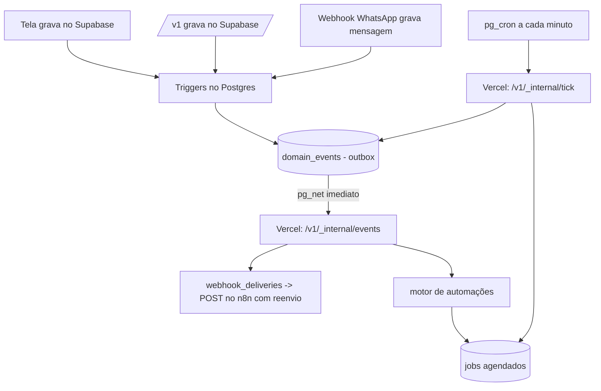

# 32 — Parte 2, blocos 4, 2, 16 e 3: fundação no servidor (DESENHO)

> Não implementar sem liberação do Agadir. Ver `30-parte2-visao.md`.

## Os três problemas que esta fundação resolve

1. **Eventos de CRM saem do navegador** (`store.js` → `/api/integrations/emit`). Se a mudança
   acontece por outro caminho, o evento não sai; o navegador pode fechar antes de mandar.
2. **Automações rodam no navegador** (`runAutomations` em `store.js`). Lead criado pela API ou
   por outra pessoa com a tela fechada não dispara nada; "Aguardar dias" e "Lead sem atividade"
   são impossíveis (estão marcados "em breve").
3. **Webhook sem reenvio.** `dispatchWebhook` faz um POST e esquece; n8n fora do ar = evento
   perdido.

E o que vem depois (agendadas, sequências, campanhas) precisa de um **relógio** no servidor —
mas o Cron da Vercel Hobby roda só uma vez por dia.

## Desenho



### 4a. Outbox (`domain_events`)
```sql
create table if not exists public.domain_events (
  id            uuid primary key default gen_random_uuid(),
  company_id    uuid not null references public.companies(id) on delete cascade,
  event         text not null,              -- 'contact.created', 'lead.moved', ...
  entity_id     uuid,
  data          jsonb not null default '{}',
  source        text,                        -- 'ui' | 'api' | 'whatsapp' | 'automation' | 'system'
  created_at    timestamptz not null default now(),
  processed_at  timestamptz,
  attempts      integer not null default 0,
  last_error    text
);
create index on public.domain_events (processed_at, created_at);
```
**Triggers** `after insert/update` em `crm_contacts`, `crm_leads`, `crm_notes`, `conversations`
gravam o evento certo (ex.: `crm_leads` com `stage_id` mudando → `lead.moved`). Assim **qualquer**
caminho que grava no banco gera o evento, sem depender de quem gravou.

`source`: a tela não consegue dizer quem é pelo trigger; use `auth.uid()` (preenchido quando a
gravação veio com JWT) → `ui`; `service_role` → a API/servidor seta `set_config('app.source', 'api', true)`
na transação (ou grava o evento explicitamente e o trigger ignora).

### 4b. Entrega imediata + varredura
- Trigger do outbox chama `pg_net.http_post` para `/v1/_internal/events` (entrega em ~1 s).
- `pg_cron` chama `/v1/_internal/tick` a cada minuto: reprocessa o que ficou sem `processed_at`
  (falha de rede, Vercel fora) e roda os jobs vencidos.
- Autenticação dessas rotas internas: header `x-internal-secret` = variável `INTERNAL_SECRET` na
  Vercel e no **Vault** do Supabase (nunca no SQL em texto).
- Rotas internas ficam no catch-all `/v1` (não gasta função), prefixo `_internal/`, e **não**
  aceitam a chave de API do cliente.
- **Confirmar no painel do Supabase** que `pg_cron` e `pg_net` estão disponíveis no plano atual
  (Database → Extensions) antes de começar.

### 4c. Jobs (`jobs`)
```sql
create table if not exists public.jobs (
  id         uuid primary key default gen_random_uuid(),
  company_id uuid not null references public.companies(id) on delete cascade,
  type       text not null,       -- 'automation_step' | 'scheduled_message' | 'sequence_step' | 'campaign_batch' | 'webhook_retry' | 'inactivity_scan'
  run_at     timestamptz not null,
  payload    jsonb not null default '{}',
  status     text not null default 'pending' check (status in ('pending','running','done','failed','canceled')),
  attempts   integer not null default 0,
  last_error text,
  locked_at  timestamptz,
  created_at timestamptz not null default now()
);
create index on public.jobs (status, run_at);
```
Pegar jobs com uma função SQL `claim_jobs(p_limit int)` usando `for update skip locked` (dois
ticks simultâneos não pegam o mesmo job). Cada tick processa um lote pequeno para caber no tempo
máximo de uma função da Vercel; o que sobrar fica para o próximo minuto.

## Bloco 2 — eventos de CRM no servidor
Com o outbox no ar, o `dispatchWebhook` passa a ser chamado a partir de `domain_events`.
Fase A: liga por empresa (`companies.features.server_events`), e enquanto ligada a tela **para**
de chamar `/api/integrations/emit` para essa empresa (sem duplicar). Fase B: remove
`emitIntegration` do `store.js` e o arquivo `api/integrations/emit.js` (libera uma função).

## Bloco 16 — automações no servidor
`runAutomations` sai do `store.js` e vira `api/_lib/automations.js`, consumindo os eventos do
outbox (`contact.created` → gatilho `contact_created`, etc.). "Aguardar dias" vira um job
`automation_step` com `run_at` no futuro. "Lead sem atividade" vira um job diário
`inactivity_scan`. Ações que hoje usam o Supabase do navegador passam a usar `adminClient()`
com `company_id`. Mesma chave por empresa (`features.server_automations`); com ela ligada a tela
não roda mais `runAutomations` (sem execução dupla).

Cuidado: "Executar agora" em massa por etapa (tela de Automações) hoje roda no navegador; vira
um job por lead, respeitando o limitador de envio.

## Bloco 3 — webhooks com várias assinaturas e reenvio
```sql
create table if not exists public.webhook_subscriptions (
  id uuid primary key default gen_random_uuid(),
  company_id uuid not null references public.companies(id) on delete cascade,
  name text not null, url text not null, events text[] not null default '{}',
  secret text not null, enabled boolean not null default true,
  created_at timestamptz not null default now()
);
create table if not exists public.webhook_deliveries (
  id uuid primary key default gen_random_uuid(),
  company_id uuid not null, subscription_id uuid not null references public.webhook_subscriptions(id) on delete cascade,
  event_id uuid not null, event text not null,
  status text not null default 'pending' check (status in ('pending','delivered','failed')),
  attempts integer not null default 0, next_attempt_at timestamptz, response_status integer,
  last_error text, created_at timestamptz not null default now()
);
```
- Migração: a URL/eventos/segredo atuais de `company_integrations` viram a primeira assinatura.
  A API key continua em `company_integrations`.
- Reenvio com espera crescente (1 min, 5 min, 30 min, 2 h, 12 h; depois `failed`). **Mesmo
  `event_id`** em todas as tentativas (o consumidor deduplica — já documentado).
- Tela de Integrações: lista de assinaturas + registro das últimas entregas (status, tentativas,
  resposta). Rotas `GET/POST/PATCH/DELETE /v1/webhooks` e `GET /v1/webhooks/{id}/deliveries`.
- A assinatura HMAC continua idêntica (mesmo `webhooks.js`, mesma regra de serialização única).
- Limpeza: entregas `delivered` com mais de 30 dias.

## Riscos
- Evento duplicado na transição (tela e servidor mandando) → por isso a chave por empresa.
- Trigger com erro bloqueia a gravação da tela → triggers só fazem `insert` no outbox, sem lógica
  pesada, e são testados primeiro numa cópia (branch do Supabase ou empresa de teste).
- Custo do `pg_net` por evento: baixo no volume atual; monitorar.

## Aceite
Com a chave ligada na empresa de teste: criar lead pela tela com o navegador fechando logo
depois → o webhook chega; n8n desligado por 10 min → os eventos chegam quando ele volta, com o
mesmo `event_id`; automação com "Aguardar 1 dia" executa no dia seguinte sem ninguém logado.
